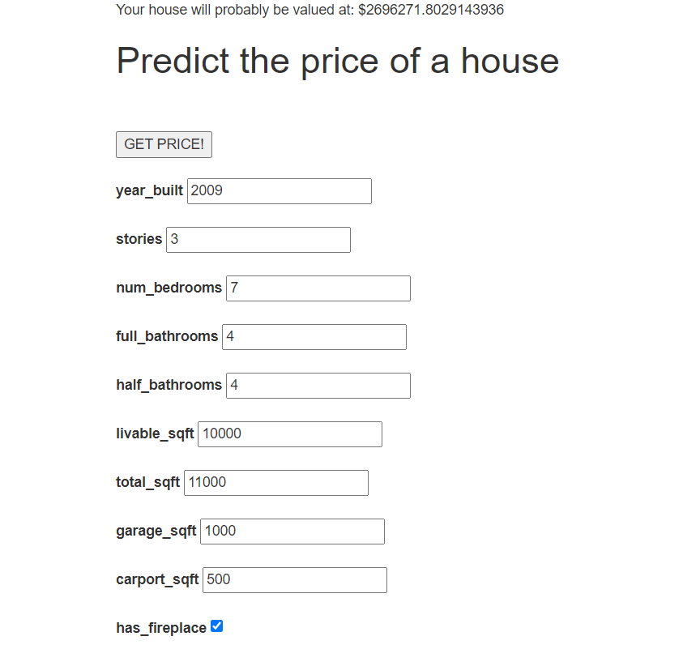
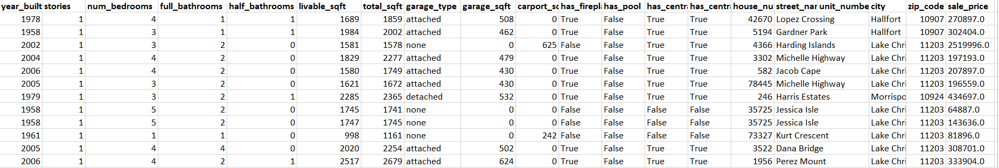

# House price prediction web application
This app takes in a user's information about their house and predicts the price of their house using a Gradient Boosting model with huber loss and 1000 regression trees of depth 6.

  

## Dataset:

  

## Containers:
The app consists of the following microservices:
MySQL DB: stores mlflow models, communicates with MLFlow via port 3306
Flask: an http server; connected to Celery via port 8000
Celery: asynchronous task processing; connected to Flask (port 8000) and MLFlow (port 5000)
Redis: stores Celery data
MLFlow: track model training

## Start 
clone the repository
go to project's folder and run 'docker-compose up' 
launch in web browser http://127.0.0.1:8000/

